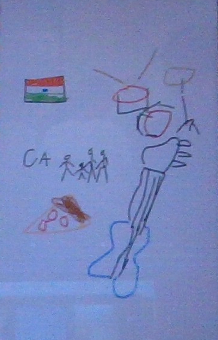

## About me 
Hi, my name is Eashaan and this is my Advanced Placement Computer Science Principles blog. I'm a Junior / in 11th grade. I'm 16 years old and my favorite color is pink. I look forward to creating some cool code and inventions in this class. 

## My Interests
I play the drums and guitar. I listen to music a lot and I play video games occaisionaly. My current favorite show is Suits and i'm interested in business like investments, real estate, and investment banking

